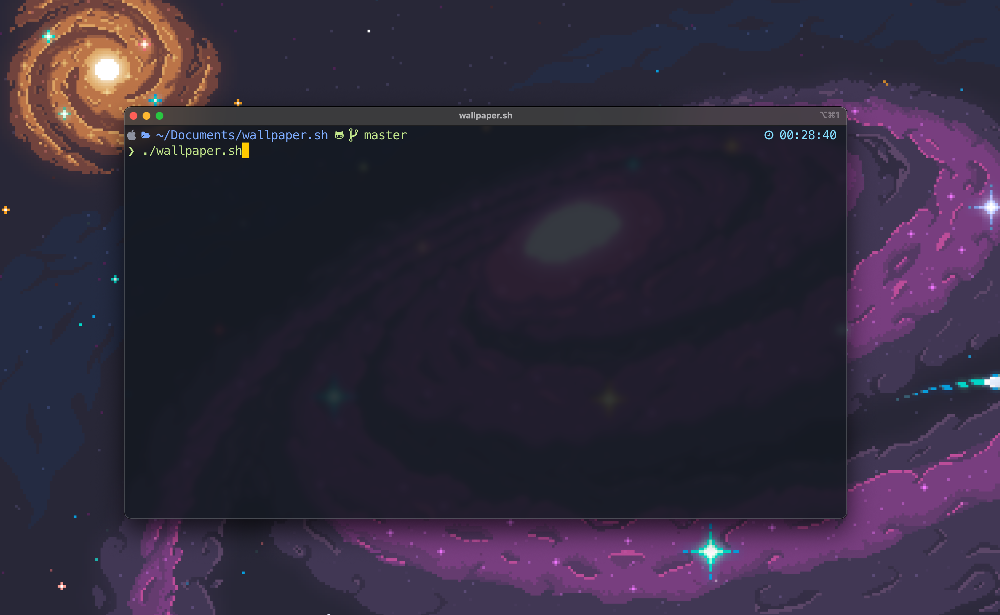
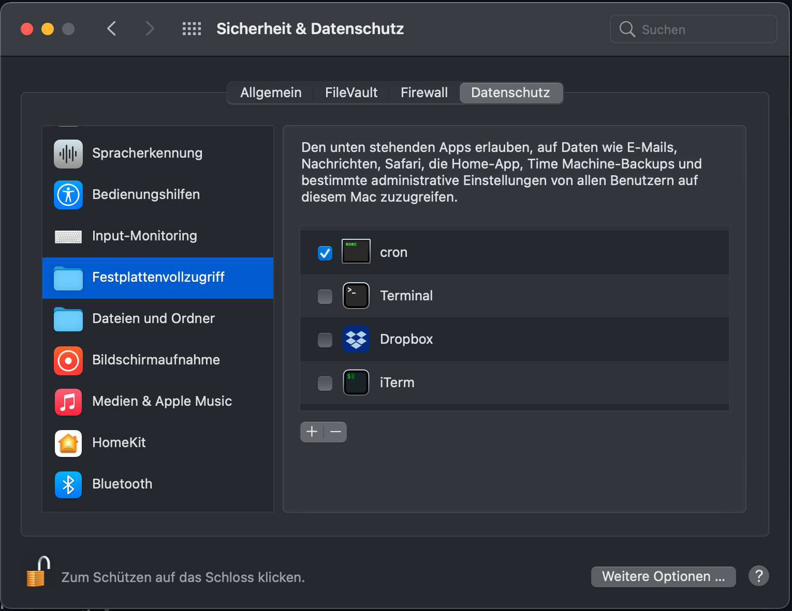

# wallpaper.sh - Wallpaper switching on MacOS through Terminal

Wallpaper.sh is a Bash script that aims to automate the tedious process of finding new wallpapers, downloading and switching them via the GUI. **wallpaper.sh** can search for specific wallpapers from unsplash or download
a random image from the specified subreddits.



## Requirements
This script is based on https://github.com/thevinter/styli.sh. It is adapted and made to work on MacOS

## Prerequisites
Homebrew Package Manager
https://brew.sh/index
```
/bin/bash -c "$(curl -fsSL https://raw.githubusercontent.com/Homebrew/install/HEAD/install.sh)"
```

gnu-getopt
```
brew install gnu-getopt
```


## Install
```
git clone https://github.com/solidsniper/wallpaper.sh
cd wallpaper.sh
chmod +x wallpaper.sh
./wallpaper.sh
```

## Usage
```
# To set a random 1920x1080 background
$ ./wallpaper.sh

# To specify a desired width or height
$ ./wallpaper.sh -w 1080 -h 720
$ ./wallpaper.sh -w 2560
$ ./wallpaper.sh -h 1440

# To set a wallpaper based on a search term
$ ./wallpaper.sh -s island
$ ./wallpaper.sh -s "sea sunset"
$ ./wallpaper.sh -s sea -w 1080

# To get a random wallpaper from one of the set subreddits
# NOTE: The width/height/search parameters DON'T work with reddit
$ ./wallpaper.sh -l reddit

# To get a random wallpaper from a custom subreddit
$ ./wallpaper.sh -r <custom_reddit>
$ ./wallpaper.sh -r wallpaperdump
```

## Cron job

Cron needs full disk access


To change background every hour launch the following command
```
crontab -e
```
and add the following to the opened file
```
@hourly path/to/script/wallpaper.sh
```

## Custom subreddits
To manage custom subreddits just edit the ```subreddits``` file by placing there all your desired communities, one for each newline

